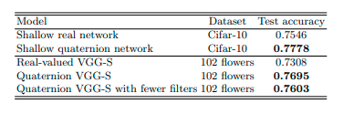

# Reproduction of quaternion convolutional neural networks (QCNN)

# Recommended sources

Original paper:

* Paper: https://arxiv.org/pdf/1903.00658.pdf
* Data: https://www.cs.toronto.edu/~kriz/cifar.html
* Github: https://github.com/Orkis-Research/Pytorch-Quaternion-Neural-Networks

Our reproduction:
* Github: https://github.com/JorisWeeda/Quaternion-Convolutional-Neural-Networks


# Summary of our work
The paper we have chosen is titled ”Quaternion Convolutional Neural Networks”. It provides a new method of processing images using neural networks by representing the image information in a better way, in the quaternion domain. Nowadays, computer vision tasks are commonly solved using convolutional neural networks (CNN), a powerful feature representation method that heavily relies on convolution layers. These convolution layers extract features from high-dimensional structural data efficiently by a set of convolution kernels. In the case of multi-channel input (e.g. RGB- or HSV-images), the results are typically summed to provide a single output for every kernel. 

Although CNNs have been proven to achieve state-of-the-art results, the processing strategy inherently suffers from some drawbacks in color image processing [paper]. The summation of the channel results ignores possible interrelationships between the colors, and there is a significant risk of losing important structural information [paper]. This paper proposes an improved method of defining image information, which preserves the relationships between the channels and provides a structural representation of color images. The main objective of this code base is to provide a reproduction of a new method for handling images in convolutional neural networks (CNN), as provided in [this paper](https://arxiv.org/pdf/1903.00658.pdf). The paper proposes an improved way of representing the images, using quaternions, before processing it through out CNN. Within this blogpost the classification results seen in table 1 from the paper are reproduced and discussed using the native library corresponding to the paper. Thereafter, an improved version of both the convolution and linear layer is coded and benchmarked against the results of the earlier gathered results.


# Introduction
Our objective was to reproduce the same results as in the paper by using the cifar-10 dataset. At first this should be done by using the already exsiting code for the QCNN, provided by the paper's git repository. To compare the results from table-1 in the paper we also needed a benchmark CNN, which applies the regular CNN structure and engine. This process also meant that the code and results needed to be validated, so besides reproducing the code, a hyperparameter check was needed. Finally if time allowed our aim was to replicate the code from scratch and with a different variant (linear layer QCNN). 

# Reproduction of results
In this blog post, we delve into the world of Convolutional Neural Networks (CNNs) and Quaternion Convolutional Neural Networks (QCNNs), comparing their approaches to each other in the color image processing field. We further explore the findings of a research paper '' that utilizes the CIFAR-10 dataset, a widely-used benchmark for image classification tasks, consisting of 60.000 32x32 color images across 10 classes.

The paper compares the architectures of CNNs and QCNNs (as detailed in Table 1), focusing on the differences in handling color information. We examine the process of reproducing both convolutional and linear layers in the networks and discuss the results obtained from these reproductions.

<br/>



_Figure 1: Classification results as proposed in the paper._

<br/>

By the end of this blog post, you will gain insights into the reproducibility of this paper, understand the respective architectures (CNN & QCNN), and learn about their performance in color image processing tasks.

## Dataset
CIFAR-10 is a dataset consisting of 60,000 32x32 color images in 10 classes, with 6,000 images per class. The classes represent common objects in the real world such as airplanes, dogs, cats, and cars. The dataset is divided into 50,000 training images and 10,000 testing images. CIFAR-10 is commonly used as a benchmark dataset for image classification tasks in the field of computer vision and deep learning. It is a relatively small dataset compared to other popular datasets such as ImageNet, but it is still challenging due to the small image size and variety of object classes.

## Convolutional based color image processing (CNN)
Convolutional Neural Networks (CNNs) are a specialized type of deep learning models that have proven to be incredibly effective in handling image data. They stand out due to their unique architecture, which is designed to imitate the human visual system. This design enables them to automatically learn and detect features from images with minimal human intervention.

Convolutional Neural Networks (CNNs) are deep learning models specifically designed for image processing. They automatically learn features from images through a series of convolutional layers, pooling layers, activation functions, and fully connected layers. By mimicking the human visual system, CNNs efficiently detect and extract patterns, structures, and meaningful information from images. This powerful architecture has made CNNs the go-to solution for tasks like image classification, object detection, and semantic segmentation.

Although CNNs have revolutionized the field of computer vision, their success lies in the way they automatically learn features from images, making them highly efficient and adaptable. As a result, they have found applications in diverse areas such as image classification, object detection, semantic segmentation, and facial recognition, to name just a few.

## Quaternion-based color image processing (QCNN) 
Quaternion Convolutional Neural Networks (QCNNs) are an extension of traditional CNNs that leverage quaternion algebra to process images more efficiently, particularly when dealing with color information. While standard CNNs operate on real-valued tensors, QCNNs use quaternion-valued tensors, enabling them to capture inter-channel correlations and reduce the number of parameters in the network. QCNNs therefore efficiently handle complex-valued data, such as color images. By representing the color images as quaternionss, QCNNs provide a more compact and expressive representation, leading to improved performance in tasks like color image classification, object detection, and semantic segmentation. By leveraging quaternion operations in their convolutional layers, QCNNs offer a more compact and computationally efficient architecture compared to traditional CNNs while maintaining or even surpassing their performance levels.

<br/>


_Figure 2: Illustration of the difference between CNN and QCNN on convolution layers._

<br/>


## Weight initialisation and training phase
Weight initialization is critical for the successful training of any network, including QCNN. In QCNN, the scaling factor $s$ controls the magnitude of the transformed vector, while the rotation angle $\theta$ is an additional parameter that only rotates the input vector. Since the projection to the gray axis is unaffected by $\theta$, we follow the suggestion in [11] and perform normalized initialization to keep the variance of the gradients constant during training. The paper proses initialize $s_j$ and $\theta$ for the $j$-th layer as two uniform random variables.

$$
\begin{align*}
  s_j \sim U \left[-\sqrt{\frac{6}{n_j+n_{j+1}}}, \sqrt{\frac{6}{n_j+n_{j+1}}}\right], \quad \theta \sim U \left[-\frac{\pi}{2}, \frac{\pi}{2}\right],
\end{align*}
$$


## Reproduced table 1
The CNN and QCNN are used for image classification with 10 classes in the CIFAR10 dataset. The CNN accepts RGB images with 3 channels, while the QCNN accepts 4 channels (including a padded zeros channel for quaternion representations). Using CIFAR-10, a popular benchmark dataset for image classification tasks in machine learning, the networska are tested on their accuracy. The dataset consists of 60,000 color images in 10 classes, with 50.000 training images and 10.000 test images. The images are of size 32x32 pixels and are labeled with one of the following classes: airplane, automobile, bird, cat, deer, dog, frog, horse, ship, and truck. The CIFAR-10 dataset is commonly used as a standard benchmark for image classification tasks, and many machine learning models have been trained and evaluated on this dataset.

As the paper lacks detailled information of layers for the CNN and QCNN the models are improved based on general knowledge and trial and error. For the extended networks there are four convolutional layers with 64, 128, 256, and 512 filters, respectively, followed by max pooling and dropout layers. Two fully connected layers are used to output the 10 classes. The kernel size for all convolutional layers is 3. During training, the model is run for 80 epochs with a learning rate of 0.0001, using an RMSprop optimizer with weight decay of 1e-6. The cross-entropy loss function is used as the criterion. Results with the explained architecture and corresponding training parameters are shown in the following table:

<br/>

| **Model**                                               | **Code base used**       | **Trainable parameters** | **Training time** | **Dataset** | **Accuracy** |
|---------------------------------------------------------|--------------------------|--------------------------|-------------------|-------------|--------------|
| Convolutional neural network (CNN)             | Pytorch                  | 5.121.482                | 39min 25s         | CIFAR10     |    75.83 %   |
| Quaternion convolutional neural network (QCNN) | Pytorch & Orkis-research | 2.032.650                | 32min 44s         | CIFAR10     |    77.05 %   |

<br/>

Important to mention is that the absence of detail architectural information on CNN as well as the QCNN results in a change of trainable parameters according to the paper. The paper explicitly mentions that QCNN should have more parameters and that both CNN and QCNN can be considered shallow networks. However, the given guidelines for number of convolution blocks, convolutional layers and linear layers describe more or less a deeper neural network as shallow networks typically have 1 or 2 hidden layers. The QCNN as a result has less paramters compared to the CNN benchmark model.

Reducing the complexity of the archticture to consist of two convolution layers, one dropout layer, one pooling layer and a single linear layer combined with softmax output provides a better representation of a shallow network. These changes improves the ratio of learnable parameters to match the statement in the paper, but does not generate usefull results as the following table shows.

<br/>

| **Model**                                               | **Code base used**       | **Trainable parameters** | **Training time** | **Dataset** | **Accuracy** |
|---------------------------------------------------------|--------------------------|--------------------------|-------------------|-------------|--------------|
| Shallow convolutional neural network (CNN)              | Pytorch                  | 289.226                  | 16min 24s         | CIFAR10     |    43.66%    |
| Shallow Quaternion convolutional neural network (QCNN)  | Pytorch & Orkis-research | 2.788.608                | 21min 42s         | CIFAR10     |    38.77%    |

<br/>

# Reproduction of the layers
This section covers the code pieces we have successfully replicated, namely the quaternion convolutional layer and the quaternion linear layer. We provide details on these layers and include the results obtained from their implementation.

## Quaternion convolutional layer
The quaternion convolutional layer is the building block of a Quaternion Convolutional Neural Network (QCNN). Unlike traditional Convolutional Neural Networks (CNNs), QCNNs use quaternion-valued filters instead of real-valued filters. A quaternion is a four-dimensional extension of complex numbers, which are composed of a real part and three imaginary parts. In the case of a QCNN, the quaternion filter contains four channels, with each channel representing the real part and the three imaginary parts.

During the forward pass of a QCNN, the input tensor is convolved with the quaternion filter to produce the output tensor. This convolution operation is different from traditional CNNs in that it involves the multiplication of two quaternions, rather than the dot product of two real-valued vectors. This allows the QCNN to capture spatial orientation information, such as roll, pitch, and yaw, which are not possible to represent using real-valued filters. The mathematical quaternion convolution introduced by the paper is summarized in the appendix.

The backward pass in a quaternion convolutional layer is similar to that in a regular convolutional layer used in traditional CNNs. The gradient with respect to the input feature map is computed by convolving the gradient with respect to the output feature map with the rotated conjugate of the filter, and then summing across all filters. The gradients with respect to the weights are computed by convolving the gradient with respect to the output feature map with the conjugate of the input feature map, and then summing across all feature maps.

The created layer is more efficient and readable when compared to the layer available on the Github repository provided by the paper. Our implementation utilizes the PyTorch methods in an improved manner, resulting in less code and enhanced readability. The created layer and provided layer from github are compared after initialisation to verify that these are initialised in a similar fashion. Three individual training runs have been executed to verify the created layer in the architecture described earlier during the result reproduction. 

<br/>

| **Training run** | **Epochs** | **Training time** | **Dataset** | **Accuracy** |
|------------------|------------|-------------------|-------------|--------------|
| 1                | 80         | 34min 43s         | CIFAR10     |    78.45%    |
| 2                | 80         | 34min 37s         | CIFAR10     |    77.72%    |
| 3                | 80         | 39min 34s         | CIFAR10     |    78.14%    |

<br/>


## Quaternion linear layer
Just like as the quaternion convolutional layer, the quaternion-based linear layer acts as an essential element in a Quaternion Convolutional Neural Network (QCNN). The network is trained using the RMSprop optimizer and the cross-entropy loss function. The training loop performs forward and backward passes on batches of the data, updating the model’s parameters with the gradients computed during backpropagation.

During the forward pass, the input tensor is passed through each layer of the network, with each layer linearly transforming the tensor based on its weights and biases. This transformation process diverges from traditional neural networks as it involves the multiplication of quaternion values instead of the dot product of real-valued vectors. The final output tensor is passed through the softmax activation function to produce the class probabilities.

During the backward pass, the loss gradient is computed with respect to each parameter in the network using the chain rule of calculus. The optimizer then updates each parameter by subtracting the product of its gradient and the learning rate, which determines the size of the steps taken in the direction of the gradient.

<br/>

| **Training run** | **Epochs** | **Training time** | **Dataset** | **Accuracy** |
|------------------|------------|-------------------|-------------|--------------|
| 1                | 80         | 30min 58s         | CIFAR10     |    76.81%    |
| 2                | 80         | 29min 47s         | CIFAR10     |    78.19%    |
| 3                | 80         | 29min 47s         | CIFAR10     |    78.02%    |

<br/>

## Different weight initialisation
The GitHub repository provides a weight initialization code that differs from the initialization method proposed in the referenced paper. The paper proposes a weight initialization method, which was applied in the reproduction of both the linear and convolutional layers using the following code snippet:
```   
    s = 1. / np.sqrt(2*fan_in)
    modulus = chi.rvs(4,loc=0,scale=s,size=kernel_shape)
```
As can be seen, this implementation does not match the earlier discussed initialisation proposed in the paper. In both the quaternoion linear and quaternoion convolutional reproductions the weight initialisation as stated by the paper is implemented using the following piece of code:
```
    modulus = nn.Parameter(torch.Tensor(*weight_shape))
    modulus = nn.init.xavier_uniform_(modulus, gain=1.0)
```

<br/>


_Figure 3: Weight initialisation following the paper and PyTorch utilities._

<br/>

# Conclusion
In conclusion, the replication process of the paper on Quaternion Convolutional Neural Networks (QCNNs) has shown varied results. Based on the provided text and the results from each table, the weight initialization technique proposed in the paper was successfully implemented and resulted in consistent gradient variance during training.

Due to the absence of detailed architectural information for the CNN and QCNN models in the paper, the models were improved based on general knowledge and trial and error. In the first experiment, the QCNN model outperformed the CNN model, achieving an accuracy of 77.05% compared to CNN's 75.83%. When the complexity of the architecture was reduced to create a shallow network representation, the results were not useful, as the shallow CNN achieved an accuracy of 43.66% while the shallow QCNN only reached 38.77%.

The quaternion convolutional and linear layers were successfully replicated and improved. Three individual training runs for each layer confirmed their effectiveness when incorporated into the architecture. The weight initialization code provided in the GitHub repository did not match the paper's proposal. After adjusting the weight initialization to follow the paper's recommendations, consistent results were obtained.

From these findings, we can infer that the paper's approach to QCNNs has potential, but the lack of detailed architectural information makes it challenging to directly replicate the results. The improved models with adapted architectures outperformed their counterparts, indicating that QCNNs may indeed offer advantages in color image processing tasks. However, the results of the shallow network experiments suggest that further investigation and optimization are needed to better understand the full potential of QCNNs.

# Discussion
In this discussion, we incorporate the findings from the experiments involving Quaternion Convolutional Neural Networks (QCNNs) and their shallow counterparts. The process included understanding the paper’s methodology, replicating the code, and conducting experiments to compare the performance of QCNNs with traditional Convolutional Neural Networks (CNNs). We also discuss the challenges faced during the replication process and the implications of the experimental results.

**Key Takeaways**

1. **Replicating the paper’s results:** Despite some challenges due to the absence of detailed architectural information for both CNN and QCNN models in the paper, we managed to replicate the results. The QCNN model outperformed the CNN model in the first experiment, achieving an accuracy of 77.05% compared to the CNN’s 75.83%.

2. **Shallow network experiments:** When the complexity of the architecture was reduced to create a shallow network representation, the results were not as promising. The shallow CNN achieved an accuracy of 43.66%, while the shallow QCNN only reached 38.77%. This suggests that the shallow architecture may not be suitable for QCNNs and that further investigation and optimization are needed to uncover their full potential.

3. **Reproduction of quaternion layers:** The quaternion convolutional and linear layers were successfully replicated and incorporated into the architecture. Three individual training runs for each layer confirmed their effectiveness, achieving accuracies between 76.81% and 78.19% for the linear layer and between 77.72% and 78.45% for the convolutional layer.

4. **Weight initialization:** A discrepancy between the weight initialization code provided in the GitHub repository and the paper’s proposal was discovered. After adjusting the weight initialization to follow the paper’s recommendations, consistent results were obtained, emphasizing the importance of proper weight initialization for achieving optimal performance.

5. **Challenges and limitations:** The replication process was hindered by the lack of detailed architectural information, making it challenging to directly replicate the results. Moreover, the results of the shallow network experiments suggest that further investigation and optimization are needed to better understand the full potential of QCNNs.

Our attempts to reproduce the results of the Quaternion Convolutional Neural Networks paper and explore their performance in shallow network settings demonstrated the potential of QCNNs in color image processing tasks. However, the lack of detailed architectural information and the less promising results of the shallow network experiments highlight the need for further investigation and optimization.

Future research could focus on exploring different architectures and optimization techniques to enhance the performance of QCNNs further. Additionally, investigating the applicability of QCNNs in other domains, such as video processing or 3D object recognition, could provide additional insights into the benefits of quaternion-based representations.

# Appendix
## Quaternion convolution
The paper explains an improved method of handling multi-channel images, as the introduction briefly mentions. First, it represents the information in the quaternion domain:
$$
\begin{align}
  \hat{\mathbf{A}}
    &= [ \hat{a}_{nn'} ] \quad \in \mathbb{H}^{N x N} \
    &= \mathbf{0} + \mathbf{R} i + \mathbf{G} j + \mathbf{B} k
\end{align}
$$
where N represents the size of the image and $\mathbf{R}, \mathbf{G}, \mathbf{B} \in \mathbb{R}^{N x N}$ represent red, green and blue channels, respectively. Using an $L x L$ quaternion convolution kernel:
$$
\begin{align}
  \hat{\mathbf{W}}
  &= [ \hat{w}_{ll'} ] \quad \in \mathbb{H}^{L x L}
\end{align}
$$
$$
\begin{align}
  \hat{w}_{ll'}
  &= s_{ll'}(cos(\frac{\mathbf{\theta}_{ll'}}{2}) + sin(\frac{\mathbf{\theta}_{ll'}}{2}) \mu)
\end{align}
$$
it is possible to define a meaningful convolution operation $\circledast$ between input $\hat{\mathbf{A}}$ and $\hat{\mathbf{W}}$. By meaningful it is meant that it should apply rotation and scaling to the (quaternion) color vector to find the best representation in the entire color space, similar to real-valued convolution when processing gray-scale images. The quaternion convolution can be defined as follows:

$$
\begin{align}
  \hat{\mathbf{A}} \circledast \hat{\mathbf{W}} 
  &= \hat{\mathbf{F}} \\
  &= [ \hat{f}_{kk'} ] \quad \mathbb{H}^{(N - L + 1) x (N - L + 1)}
\end{align}
$$

$$
\begin{align}
  \hat{\mathbf{A}} \circledast \hat{\mathbf{W}} 
  &= \hat{\mathbf{F}} \\
  &= [ \hat{f}_{kk'} ] \quad \mathbb{H}^{(N - L + 1) x (N - L + 1)}
\end{align}
$$

$$
\begin{align}
  \hat{f}_{kk'} = \sum_{l=1}^{L} \sum_{l'=1}^{L} \frac{1}{s_{ll'}} \hat{w}_{ll'} \hat{a}_{(k+l)(k'+l')} \hat{w}_{ll'}^{*}
\end{align}
$$

The collection of all such convolution kernels formulates the proposed quaternion convolution layer. Representing each $\hat{a}_{nn'}$ as a vector in 3D space, $\hat{\mathbf{a}}_{nn'} = [a_1 a_2 a_3]^\top$, results in the above equation to be a matrix multiplication. According to the rule of quaternion computations, if we represent each $\hat{a}_{nn0}$ as a 3D vector $\mathbf{a}_{nn0} = [a_1 \quad a_2 \quad a_3]$, then the operation in the previous equation can be represented by a set of matrix multiplications, where $\hat{f}_{kk0}$ is a vectorized representation of quaternion $\hat{f}_{kk0}$:

$$
\begin{align}
  \hat{f}_{kk'} = \sum_{l=1}^{L} \sum_{l_0=1}^{L_0} s_{ll_0} \begin{bmatrix}
  f_1 & f_2 & f_3 \\
  f_3 & f_1 & f_2 \\
  f_2 & f_3 & f_1
  \end{bmatrix} \mathbf{a}_{k+l,k_0+l_0},
\end{align}
$$

$$
\begin{align}
  f_1 = \frac{1}{3} + \frac{2}{3} \cos \theta_{ll_0},
  \quad
  f_2 = \frac{1}{3} - \frac{2}{3} \cos(\theta_{ll_0} - \frac{\pi}{3}),
  \quad
  f_3 = \frac{1}{3} - \frac{2}{3} \cos(\theta_{ll_0} + \frac{\pi}{3}).
\end{align}
$$

According to the rule of quaternion computations, if we represent each $\hat{a}_{nn0}$ as a 3D vector $\mathbf{a}_{nn0} = [a_1 \quad a_2 \quad a_3]$, then the operation in the previous equation can be represented by a set of matrix multiplications:

$$
\begin{align}
  \hat{f}_{kk'} = \sum_{l=1}^{L} \sum_{l_0=1}^{L_0} s_{ll_0} \begin{bmatrix}
  f_1 & f_2 & f_3 \\
  f_3 & f_1 & f_2 \\
  f_2 & f_3 & f_1
  \end{bmatrix} \mathbf{a}_{k+l,k_0+l_0},
\end{align}
$$

$$
\begin{align}
  f_1 = \frac{1}{3} + \frac{2}{3} \cos \theta_{ll_0},
  \quad
  f_2 = \frac{1}{3} - \frac{2}{3} \cos(\theta_{ll_0} - \frac{\pi}{3}),
  \quad
  f_3 = \frac{1}{3} - \frac{2}{3} \cos(\theta_{ll_0} + \frac
  {\pi}{3}).
\end{align}
$$
